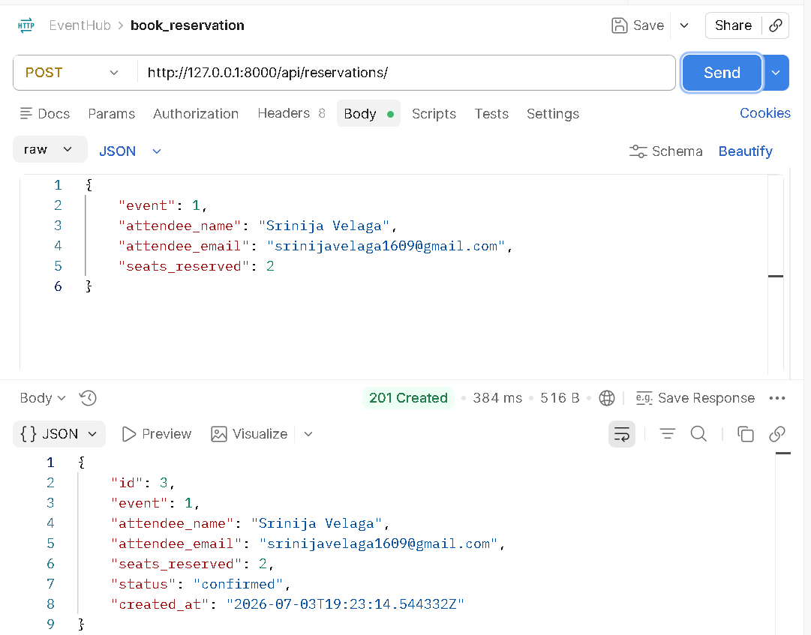
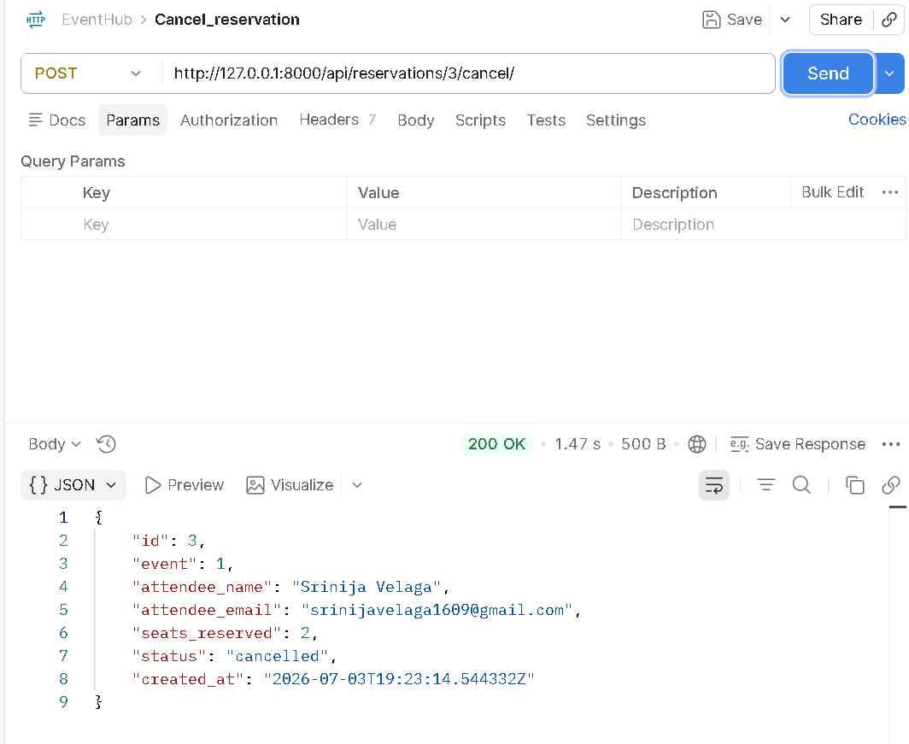

# EventHub API

A Django REST Framework backend API for managing event ticket reservations. Users can create events, reserve seats, cancel reservations, and filter events and reservations.

---

# How to Run

## Requirements

- Python 3.11
- Django 5.2
- Django REST Framework

## Installation

pip install -r requirements.txt

Apply migrations:

python manage.py migrate

Run the development server:

python manage.py runserver

The API will be available at:

http://127.0.0.1:8000/api/

---

# API Endpoints

## Event Endpoints

| Method | Endpoint | Description |
|--------|----------|-------------|
| POST | `/api/events/` | Create a new event |
| GET | `/api/events/` | Get all events |
| GET | `/api/events/?status=upcoming` | Filter events by status |
| GET | `/api/events/?venue=Chennai` | Filter events by venue |

---

## Reservation Endpoints

| Method | Endpoint | Description |
|--------|----------|-------------|
| POST | `/api/reservations/` | Create a reservation |
| GET | `/api/reservations/` | Get all reservations |
| GET | `/api/reservations/?event_id=1` | Filter reservations by event |
| POST | `/api/reservations/{id}/cancel/` | Cancel a reservation and restore seats |

---

# Sample Request

## Create Event

{
    "title": "Python Conference",
    "venue": "Chennai",
    "date": "2026-08-15",
    "total_seats": 500,
    "available_seats": 500,
    "status": "upcoming"
}

---

## Create Reservation

{
    "event": 1,
    "attendee_name": "Srinija Velaga",
    "attendee_email": "srinijavelaga1609@gmail.com",
    "seats_reserved": 2
}

---

# Design Decision

Seat management is handled inside the `ReservationSerializer.create()` method instead of the ViewSet.

**Reason:**
Keeping the reservation creation and seat deduction logic together ensures that seat availability is updated immediately whenever a reservation is successfully created. This centralizes the business logic, improves maintainability, and follows Django REST Framework best practices.

The reservation cancellation is implemented as a custom ViewSet action (`POST /api/reservations/{id}/cancel/`). Instead of deleting the reservation, the API updates its status to `cancelled` and restores the reserved seats back to the associated event. This preserves reservation history while maintaining accurate seat availability.

---

# Project Structure

eventhub/
│
├── manage.py
├── db.sqlite3
├── requirements.txt
├── README.md
│
├── eventhub/
│   ├── settings.py
│   ├── urls.py
│   └── ...
│
└── events/
    ├── models.py
    ├── serializers.py
    ├── views.py
    ├── middleware.py
    ├── urls.py
    └── migrations/

---

# Middleware

A custom `RequestLoggingMiddleware` logs:

- HTTP Method
- Request Path
- Response Status Code
- Request Execution Time

for every incoming request.

---

# Testing

Postman screenshots:

- Successful Reservation (201 Created)

- Overbooking Validation (400 Bad Request)

- Successful Reservation Cancellation (200 OK)

---

# Author

**Srinija Velaga**