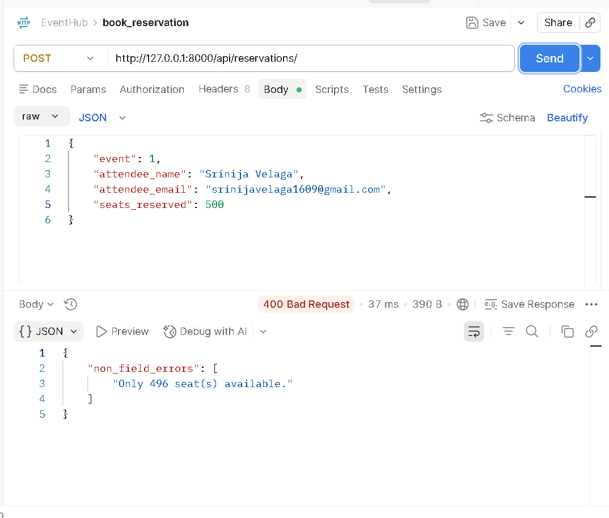
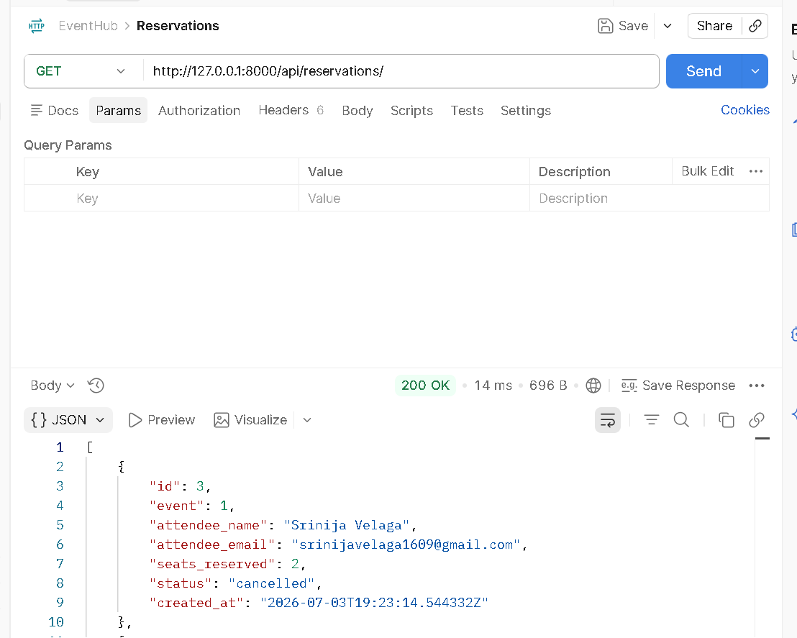

# EventHub API


A Django REST Framework backend API for managing event ticket reservations.

The API allows users to:

- Create and manage events
- Reserve seats for events
- Prevent overbooking
- Cancel reservations and automatically restore seats
- Filter events and reservations
- Log every incoming request using custom middleware

---

# Features

- Create, view, update and delete events
- Create, view, update and delete reservations
- Automatic seat availability management
- Overbooking validation
- Reservation cancellation with seat restoration
- Filter events by status
- Filter events by venue
- Filter reservations by event
- Custom request logging middleware
- RESTful API using Django REST Framework

---

# Technologies Used

- Python 3.11
- Django 5.2
- Django REST Framework
- SQLite

---

# Installation

Clone the repository

```bash
git clone https://github.com/srinija169/eventhub-api.git
cd eventhub-api
```

Install dependencies

```bash
pip install -r requirements.txt
```

Apply migrations

```bash
python manage.py migrate
```

Run the server

```bash
python manage.py runserver
```

The API will be available at:

```
http://127.0.0.1:8000/api/
```

---

# API Endpoints

## Event Endpoints

| Method | Endpoint | Description |
|---------|----------|-------------|
| POST | `/api/events/` | Create a new event |
| GET | `/api/events/` | Get all events |
| GET | `/api/events/?status=upcoming` | Filter events by status |
| GET | `/api/events/?venue=Chennai` | Filter events by venue |
| GET | `/api/events/{id}/` | Get event by ID |
| PUT | `/api/events/{id}/` | Update an event |
| DELETE | `/api/events/{id}/` | Delete an event |

---

## Reservation Endpoints

| Method | Endpoint | Description |
|---------|----------|-------------|
| POST | `/api/reservations/` | Create reservation |
| GET | `/api/reservations/` | Get all reservations |
| GET | `/api/reservations/?event_id=1` | Filter reservations by event |
| GET | `/api/reservations/{id}/` | Get reservation by ID |
| PUT | `/api/reservations/{id}/` | Update reservation |
| DELETE | `/api/reservations/{id}/` | Delete reservation |
| POST | `/api/reservations/{id}/cancel/` | Cancel reservation and restore seats |

---

# Sample Requests

## Create Event

```json
{
    "title": "Python Conference",
    "venue": "Chennai",
    "date": "2026-08-15",
    "total_seats": 500,
    "available_seats": 500,
    "status": "upcoming"
}
```

---

## Create Reservation

```json
{
    "event": 1,
    "attendee_name": "Srinija Velaga",
    "attendee_email": "srinijavelaga1609@gmail.com",
    "seats_reserved": 2
}
```

---

## Sample Event Response

```json
{
    "id": 1,
    "title": "Python Conference",
    "venue": "Chennai",
    "date": "2026-08-15",
    "total_seats": 500,
    "available_seats": 498,
    "status": "upcoming",
    "reservations_count": 1
}
```

---

## Sample Reservation Response

```json
{
    "id": 1,
    "event": 1,
    "attendee_name": "Srinija Velaga",
    "attendee_email": "srinijavelaga1609@gmail.com",
    "seats_reserved": 2,
    "status": "confirmed"
}
```

---

# Validation

The API validates:

- Required fields
- Valid email addresses
- Seat availability
- Event existence
- Reservation cancellation status

If a reservation exceeds the available seats, the API returns:

```json
{
    "non_field_errors": [
        "Only 498 seat(s) available."
    ]
}
```

---

# Design Decisions

## Reservation Logic

Seat reservation logic is implemented inside the `ReservationSerializer.create()` method.

This ensures:

- Business logic remains centralized
- Seats are deducted only after successful validation
- Data consistency is maintained

---

## Reservation Cancellation

Reservation cancellation is implemented as a custom ViewSet action.

```
POST /api/reservations/{id}/cancel/
```

Instead of deleting the reservation:

- Reservation status is changed to **cancelled**
- Reserved seats are restored back to the event
- Reservation history is preserved

---

## Filtering

Events can be filtered by:

- Status
- Venue

Reservations can be filtered by:

- Event ID

---

# Custom Middleware

The project includes a custom middleware:

```
RequestLoggingMiddleware
```

It logs every incoming request including:

- HTTP Method
- Request Path
- Response Status Code
- Request Execution Time

Example log:

```
GET /api/events/ - 200 - 0.02s
```

---

# Project Structure

```text
eventhub-api/
│
├── manage.py
├── requirements.txt
├── README.md
├── db.sqlite3
│
├── eventhub/
│   ├── settings.py
│   ├── urls.py
│   ├── wsgi.py
│   └── asgi.py
│
└── events/
    ├── admin.py
    ├── middleware.py
    ├── models.py
    ├── serializers.py
    ├── views.py
    ├── urls.py
    ├── tests.py
    └── migrations/
```

---

# Testing

The API was tested using:

- Django REST Framework Browsable API
- Postman

### Successful Reservation


---

### Overbooking Validation



---

### Reservation Cancellation


---

### Get Reservations



---

# Future Improvements

- JWT Authentication
- User registration and login
- Pagination
- Search functionality
- Docker support
- Swagger/OpenAPI documentation
- Unit tests
- Deployment on Render or Azure

---

# Author

**Srinija Velaga**

GitHub: https://github.com/srinija169

---

## License

This project is developed for learning and educational purposes.
